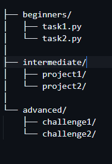

# 100 Days of Code: Python Project

Welcome to the 100 Days of Code project repository! This project is designed to help students of all levels, from beginners to advanced, improve their Python programming skills by committing to coding for 100 consecutive days. By contributing to this repository, you'll have the opportunity to learn, collaborate, and grow as a Python developer.

## Table of Contents

1. [Introduction](#introduction)
2. [Getting Started](#getting-started)
3. [How to Contribute](#how-to-contribute)
4. [Project Structure](#project-structure)
5. [Guidelines](#guidelines)
6. [Resources](#resources)
7. [Contact](#contact)
8. [Tasks](./tasks.md)
9. [100 days of code](./100daysofcode.md)

## Introduction

The 100 Days of Code project is a community-driven initiative aimed at encouraging consistent practice and learning. Each day, participants are encouraged to write code, document their progress, and share their experiences. This repository contains a variety of exercises, projects, and challenges suitable for different skill levels.

After solving each problem, please take the time to test your solution and makesure that your solution works perfectly well before making a pull request (**Write Test for yout solutions**). This exercise will go a long way to help you cultivate the habit of writing tests. Writing tests is an essential skill in the world of programming as it proves that your solution is credeble and utilized to solve problems without fear of failure.

## Getting Started

To start contributing, follow these steps:

1. **Fork the Repository:** Click the "Fork" button on the top right corner of this repository to create a copy in your GitHub account.
2. **Clone the Repository:** Clone the forked repository to your local machine using the following command:
    ```bash
    git clone https://github.com/your-username/100-days-of-code-python.git
    ```
3. **Navigate to the Project Directory:**
    ```bash
    cd 100-days-of-code-python
    ```

## How to Contribute

### Beginners
[Link to beginner tasks](./tasks.md/#beginners) 

1. **Choose a Task:** Navigate to the `beginners` folder and choose a task or exercise.
2. **Create a Branch:** Create a new branch for your task.
    ```bash
    git checkout -b beginners/task-name
    ```
3. **Write Code:** Complete the task by writing your code in a new file or editing an existing one.
4. **Commit Changes:**
    ```bash
    git add .
    git commit -m "Completed beginners task: task-name"
    ```
5. **Push to GitHub:**
    ```bash
    git push origin beginners/task-name
    ```
6. **Create a Pull Request:** Go to your repository on GitHub and create a pull request to merge your changes into the main repository.


### Intermediate

[Link to Intermediate tasks](./tasks.md/#intermediate)

1. **Choose a Project:** Navigate to the `intermediate` folder and choose a project.
2. **Create a Branch:** Create a new branch for your project.
    ```bash
    git checkout -b intermediate/project-name
    ```
3. **Write Code:** Develop your project by writing your code in a new file or editing an existing one.
4. **Commit Changes:**
    ```bash
    git add .
    git commit -m "Completed intermediate project: project-name"
    ```
5. **Push to GitHub:**
    ```bash
    git push origin intermediate/project-name
    ```
6. **Create a Pull Request:** Go to your repository on GitHub and create a pull request to merge your changes into the main repository.

### Advanced
[Link to advanced tasks](./tasks.md/#advanced)

1. **Choose a Challenge:** Navigate to the `advanced` folder and choose a challenge.
2. **Create a Branch:** Create a new branch for your challenge.
    ```bash
    git checkout -b advanced/challenge-name
    ```
3. **Write Code:** Tackle the challenge by writing your code in a new file or editing an existing one.
4. **Commit Changes:**
    ```bash
    git add .
    git commit -m "Completed advanced challenge: challenge-name"
    ```
5. **Push to GitHub:**
    ```bash
    git push origin advanced/challenge-name
    ```
6. **Create a Pull Request:** Go to your repository on GitHub and create a pull request to merge your changes into the main repository.

## Project Structure

The repository is organized into three main sections:
1. Beginner
2. Intermediate
3. Advanced

Select the category that best suits your skills level in python.

Inside the category folder, create another directory(folder) with your name (github username preferrably) and write your solutions inside it.

Name each solution with the name of the day, e.g. `day_1_tastk.py` and your solutions should be in a funtions named `task_solution` such as:

```py
def task_solution(num1, num2):
    result = num1 + num2
    return result
```
In the above example, the task is the add two numbers, each solution should be in this format for smooth running of tests to solutions before they are merged.

- ### Example of foler structure
We exoect to see the following structure in your solution
```
|-Beginner
|  |__Ezi-code
|       |-day_1_task.py
```

<!--  -->

# Resources 
**Python Resources**

[Python Documentation](https://docs.python.org/3/)

[Introduction to python](https://www.youtube.com/watch?v=kqtD5dpn9C8)

[Intermediate python course](https://www.youtube.com/watch?v=yetjswpSAsA&list=PLOLrQ9Pn6caws6aPJoCD_UmWRE91257Xm)

**Git and GitHub Resources**\
[Introduction to Git and GitHub](https://www.youtube.com/watch?v=l2yrJtwoC_E)

# Contact Us
Please feel free to leave us your comments through out email as we would love to improve upon this program in the future.

**Happy Coding!!!!**  
```
aamusted@pyclubs.org
```
This is also a link to a whatsapp platform dedicated for this project: [WhatsApp Group Link](https://chat.whatsapp.com/CpkclfVGWjl7p4uTwxwsCI) 

Club Lead [Ezra Yendau](https://github.com/ezi-code)\
Co-lead [Addison Jnr]()\
Sevretaty [Amenyo George]()\
Ladies Lead [Esson Hajirah Tawiah](https://github.com/Erhmprez)
